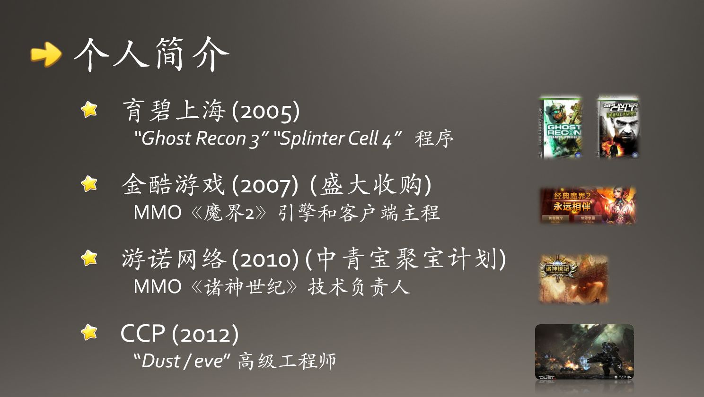

Time | Org | Projects | Title | Skillset
--------------- | ------------------ | ----------------------------- | --------------------- | -----------------
2005.03 - 2007.03 | 上海育碧 (Ubisoft Shanghai) | 幽灵行动3 (XBox), 细胞分裂4 (XBox360/PS3) | 程序员 | Unreal 2
2007.12 - 2010.06 | 上海金酷 (被盛大收购) | 魔界2 | 引擎组组长 | Gamebryo 2.3/2.5
2010.12 - 2012.07 | 上海游诺 (中青宝投资) | 诸神世纪 | 技术负责人 | 自研
2012.08 - 2014.04 | CCP | Dust/EVE | 高级工程师 | Unreal 3/自研
2014.05 - | 西山居 (珠海) | 剑三端游性能优化/剑三口袋版开发/其他手游项目诊断和优化 | 程序经理 | 自研/Unity/cocos2d-x

